# 2025's Top 13 Best AI Content Optimization Platforms

Staring at blank pages wondering which keywords to target, how much content to write, and whether your article will actually rank feels like gambling with your content budget. AI content optimization tools eliminate this guesswork by analyzing top-ranking pages, revealing competitor gaps, and providing data-driven recommendations on exactly what to include for maximum search visibility. The right platform transforms content strategy from intuition-based hoping into systematic planning where you know topic difficulty, required depth, and optimization targets before writing a single word.

## **[MarketMuse](https://www.marketmuse.com)**

Patented AI delivering enterprise-grade content strategy through topic modeling and authority analysis.

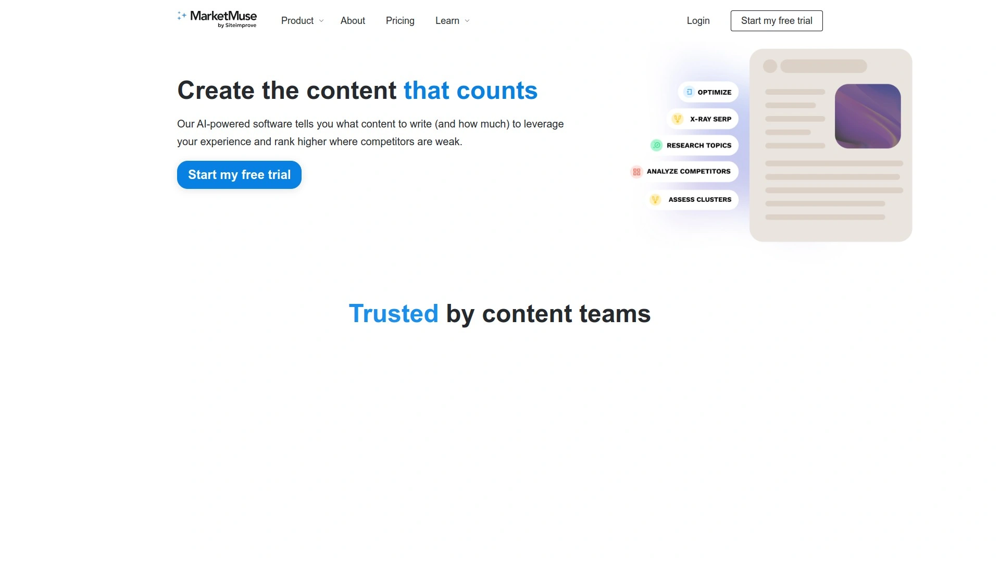

MarketMuse pioneered topic modeling technology that analyzes your entire content inventory automatically, identifying existing topical authority clusters and revealing quick wins based on what you already rank for. Personalized difficulty scores show which topics remain easiest to rank for given your specific domain authority, preventing wasted effort on impossibly competitive keywords. Competitor gap analysis locates content opportunities rivals missed, letting you stand out rather than following the pack.

Automated content briefs generate in minutes rather than hours of manual research, providing writers structured direction including semantic terms, competitor insights, and optimal content depth. Research application organizes SERP analysis with heatmap visualizations speeding audits significantly. Content plan feature delivers personalized roadmaps showing precisely which content to create or update first for maximum impact.

**Strategic depth** exceeds simple keyword tools through comprehensive topic clusters spanning entire sites rather than isolated pages. Inventory tracking monitors content performance across large domains, prioritizing updates delivering highest returns. The platform particularly suits enterprise strategists managing substantial content libraries requiring systematic governance.

Free tier enables exploring workflows before committing financially, though advanced features require paid plans starting at $99 monthly. Steep learning curve rewards investment for teams embracing process-driven content operations. MarketMuse benefits organizations prioritizing long-term topical authority over quick wins, willing to invest in comprehensive planning infrastructure.

## **[Surfer SEO](https://surferseo.com)**

Industry-leading content editor with real-time optimization scoring and seamless workflow integrations.

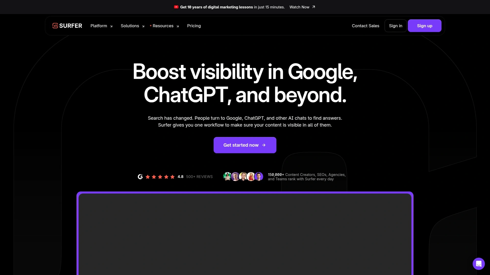

Surfer SEO delivers gold-standard content optimization through sophisticated NLP analysis balanced with exceptional usability that requires minimal training. Real-time content scoring provides clear actionable recommendations while you write, eliminating post-draft optimization cycles. Seamless Google Docs and WordPress integrations fit naturally into existing workflows without forcing platform switches.

SERP Analyzer examines top-ranking pages revealing patterns around word count, heading structure, keyword density, and semantic terms. Content Editor highlights exactly where to incorporate suggested keywords maintaining natural flow rather than awkward stuffing. Automatic internal linking identifies optimal anchor text and target pages strengthening site architecture.

**Proven track record** for improving search rankings makes Surfer the reliable choice content teams trust. Surfer AI generates complete drafts though quality requires human editing justifying additional costs beyond base subscription. Usage limits on lower tiers restrict high-volume operations requiring premium plans.

Plans start at $99 monthly for individual users scaling to enterprise tiers supporting agencies. Over 150,000 professionals rely on Surfer making it arguably the most popular content optimization software. The platform excels for teams prioritizing both effectiveness and implementation ease over advanced strategic features.

## **[Clearscope](https://www.clearscope.io)**

Premium content intelligence platform emphasizing precision and unlimited team collaboration.

Clearscope provides A-F content grading system delivering precise keyword suggestions and related term recommendations that consistently outperform competitors in accuracy. Unlimited user accounts enable entire organizations collaborating without per-seat pricing restrictions. Content inventory tracking monitors performance across portfolios identifying optimization opportunities.

Google Docs integration allows real-time optimization during drafting with shared brief templates maintaining consistency. Readability analysis ensures content remains accessible while word count guidance prevents under or over-writing. Competitor content analysis reveals what works for rivals informing your approach.

**Enterprise focus** means stellar support with knowledgeable assistance for technical issues. Pricing starts at $189 monthly reflecting premium positioning though accuracy and collaboration features justify investment for established teams. The platform targets precision-driven content operations refusing to compromise quality for affordability.

Learning curve remains moderate with intuitive interface despite sophisticated capabilities. Clearscope suits agencies, editorial teams, and content operations where accuracy matters more than budget constraints. The platform benefits users valuing best-in-class recommendations over experimental features.

## **[Frase](https://www.frase.io)**

All-in-one platform combining SERP research, AI writing, and optimization at accessible pricing.

Frase delivers exceptional value by consolidating SERP research, AI content generation, and optimization into one streamlined workflow starting at $45 monthly. Automated content brief generation saves significant research time pulling questions, headings, and topics from top-ranking pages. Integrated AI writer helps overcome blank page paralysis accelerating draft production.

SERP research tools analyze competitors revealing content structure, topics covered, and semantic terms ranking pages use. Question research surfaces queries from Google People Also Ask, Reddit, and Quora ensuring comprehensive coverage. Optimization editor provides real-time scoring as you write similar to premium alternatives.

**Affordability makes** Frase accessible for small businesses and individual creators unable to justify enterprise tool costs. Keyword recommendations lack precision compared to Surfer or Clearscope requiring more manual judgment. AI-generated content needs substantial editing for quality and accuracy.

Five-day free trial enables thorough testing before commitment. The platform particularly suits solo creators and small teams needing complete research-to-publish workflows rather than specialized optimization. Frase benefits budget-conscious users prioritizing comprehensive features over maximum accuracy.

## **[Content Harmony](https://www.contentharmony.com)**

Workflow-focused platform supporting entire content creation process from research through grading.

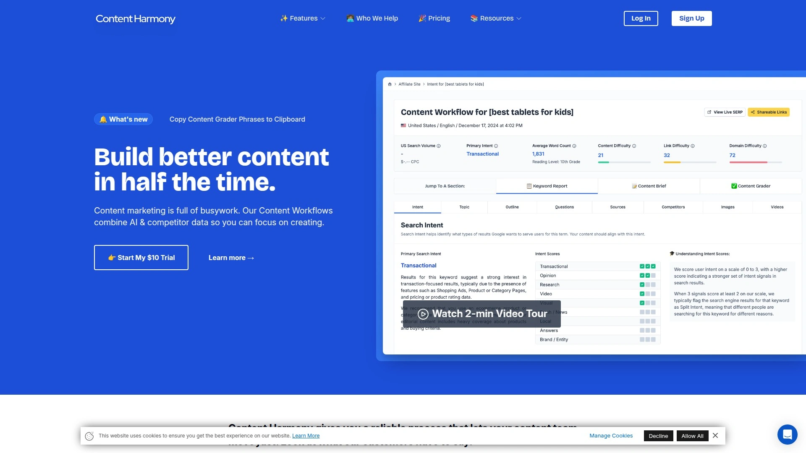

Content Harmony streamlines complete content workflows providing comprehensive insights without requiring dozens of browser tabs. Keyword reports deliver search intent analysis, topic modeling, competitor outlines, difficulty metrics, and visual content requirements in unified interface. Content briefs receive equal attention to optimization graders unlike competitors prioritizing one over the other.

Search intent classification system helps determine whether queries demand informational, commercial, or transactional content preventing format mismatches. Internal and external link suggestions boost authority by identifying optimal linking opportunities. Visual content research reveals image and video requirements competitors use successfully.

**Unlimited team seats** eliminate per-user pricing enabling organization-wide access. Plans start at $50 monthly billing only for data consumed rather than arbitrary seat restrictions. The platform particularly suits strategists who build detailed briefs for writers rather than writing directly.

Collaboration features include sharable briefs, cross-team integration, and standardized formatting maintaining consistency. Content Harmony benefits SEO agencies and content teams wanting comprehensive brief-building capabilities at accessible pricing. The platform excels for process-driven operations valuing workflow integration.

## **[Rankability](https://www.rankability.com)**

Premium optimizer combining IBM Watson and Google NLP with expert coaching.

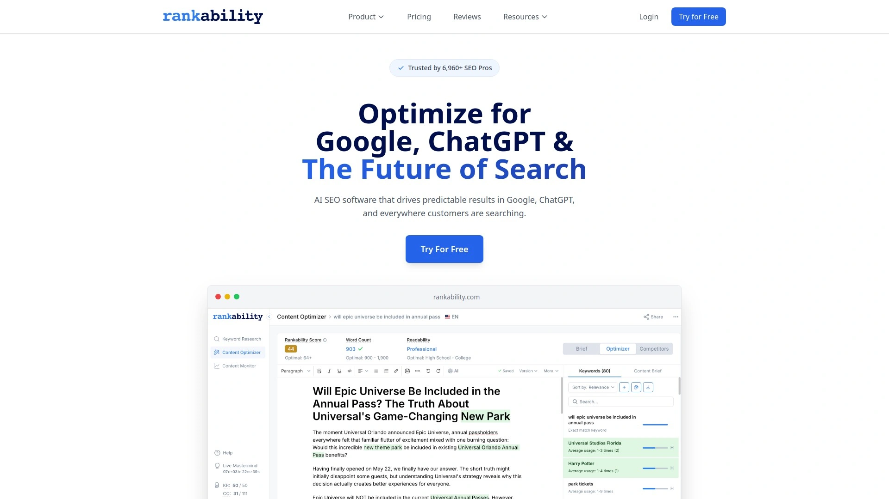

Rankability stands out through dual NLP approach blending IBM Watson and Google natural language understanding delivering exceptionally accurate keyword recommendations. Real-time content scoring provides precise optimization guidance while automated SEO briefs accelerate research. Monthly coaching calls with SEO experts add significant value beyond software alone.

Geographic-focused optimization accommodates local SEO needs that generic tools overlook. Live scoring updates as you type showing immediate impact of content changes. Included training transforms this from tool into comprehensive SEO education platform.

**Premium pricing** at $149 monthly reflects sophisticated technology and expert guidance. The dual NLP methodology produces more relevant semantic suggestions and faster ranking improvements than single-source alternatives. Unlimited article generation across all tiers includes AI writer without additional costs.

Best suited for agencies and consultants who leverage both advanced technology and expert coaching justifying premium investment. The platform benefits users wanting comprehensive SEO support beyond software. Rankability excels for teams prioritizing accuracy and education over affordability.

## **[Page Optimizer Pro](https://pageoptimizerpro.com)**

Focused on-page SEO tool delivering granular optimization recommendations.

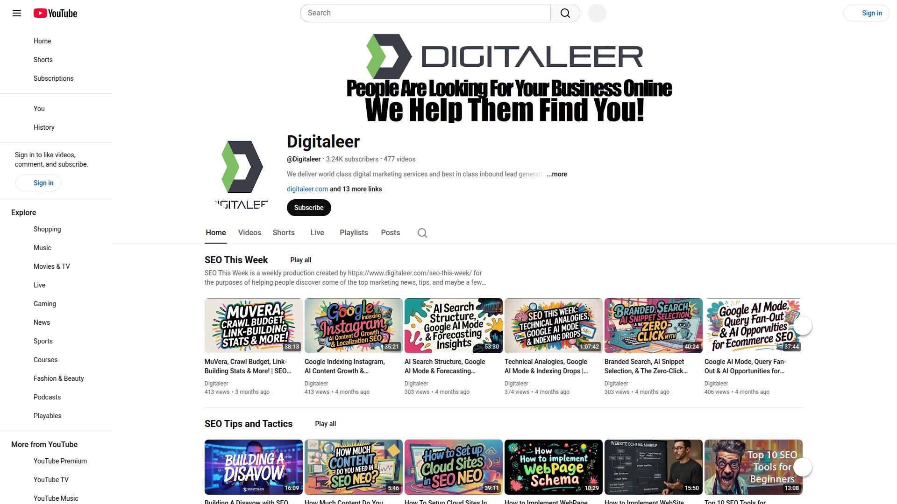

Page Optimizer Pro specializes in on-page optimization providing detailed term frequency analysis and semantic keyword suggestions. Lightning-fast report generation produces actionable insights within seconds. Chrome extension enables quick analysis directly from search results.

Watchdog monitoring alerts when rankings drop or competitors make changes enabling rapid response. LSI keyword identification reveals semantically related terms improving topical relevance. Competitive comparison shows exactly how your pages stack against top rankers.

**Affordable pricing** starts at $34 monthly making professional optimization accessible. The focused approach on on-page factors means missing broader content strategy features competitors provide. Granular recommendations suit detail-oriented optimizers wanting precise guidance.

Moderate learning curve with straightforward interface focusing on essentials. Page Optimizer Pro benefits SEO specialists and agencies prioritizing on-page precision over comprehensive content workflows. The platform excels for users wanting fast, accurate optimization without feature bloat.

## **[Scalenut](https://www.scalenut.com)**

AI-powered platform emphasizing automation through Cruise Mode article generation.

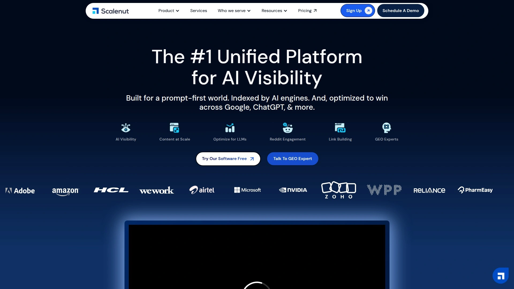

Scalenut delivers strong generative AI and SEO blend creating optimized first drafts in under five minutes via Cruise Mode feature. Article Writer generates factual, plagiarism-free content automatically while Content Optimizer analyzes existing pages suggesting fixes. Keyword Planner performs SERP-based clustering helping create pillar content increasing domain authority.

Traffic analyzer loads Google Search Console data revealing impressions, positions, and click-through rates. Topic research utilizes top 30 URLs for comprehensive analysis including social listening and NLP terms. Auto-optimization features implement SEO recommendations directly without manual changes.

**Automation focus** suits teams wanting hands-off content generation though quality requires human review. Pricing starts at $49 monthly positioning as affordable all-in-one solution. The platform particularly benefits teams scaling content production through AI assistance.

Comprehensive feature set competes with pricier alternatives at accessible rates. Scalenut suits marketers prioritizing speed and volume over artisanal content quality. The platform excels for rapid content scaling where AI-generated foundations need human polish.

## **[Dashword](https://www.dashword.com)**

Content optimization with ongoing monitoring and decay alerts.

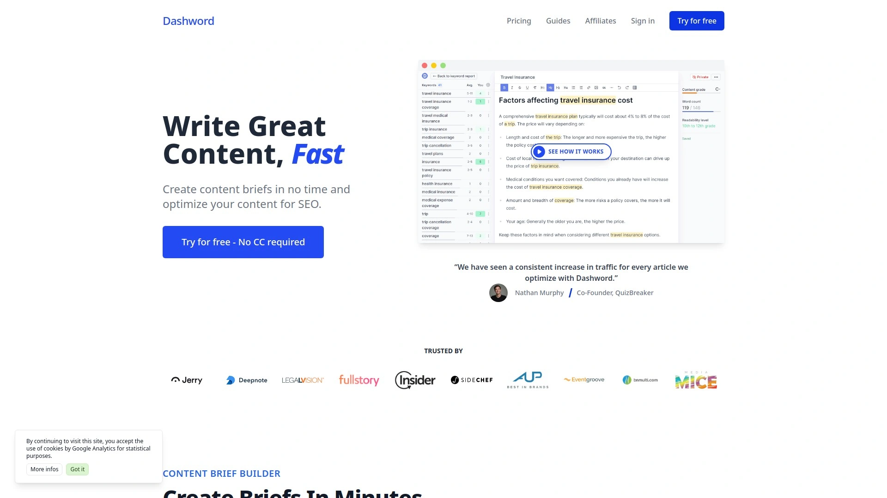

Dashword provides briefs, optimization, and unique monitoring features alerting when content performance declines. Content decay detection identifies pages losing rankings enabling proactive updates. Reporting features track content performance over time revealing optimization impact.

Straightforward interface focuses on essentials without overwhelming complexity. Real-time optimization feedback guides improvements during writing. Competitive tracking monitors how rivals' content changes affect your rankings.

**Ongoing upkeep** emphasis differentiates Dashword from create-and-forget competitors. Pricing starts at $39 monthly making it accessible for bloggers and small teams. The platform particularly suits content managers maintaining large libraries requiring systematic monitoring.

Best for ongoing content maintenance rather than initial creation. Dashword benefits users recognizing content optimization as continuous process not one-time task. The platform excels for teams prioritizing long-term content health over initial optimization.

## **[seoClarity](https://www.seoclarity.net)**

Enterprise SEO platform with advanced AI and comprehensive technical capabilities.

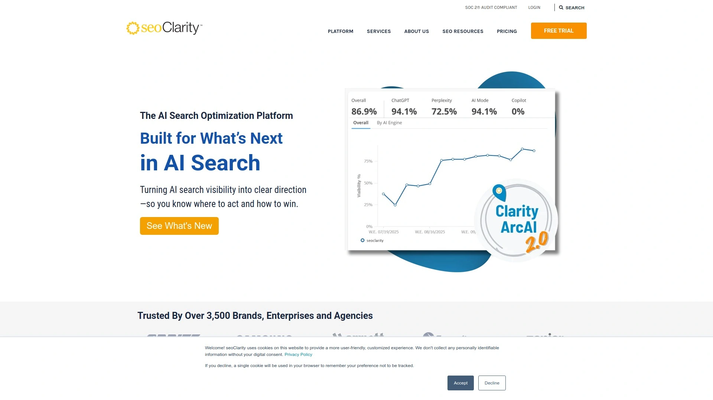

seoClarity delivers enterprise-grade SEO combining content creation, technical auditing, and rank tracking at scale. GenAI and NLP integration drives content generation with emphasis on user intent and enriched data insights. Clarity360 organizes technical data by URL making it easy to see what's crawlable, indexed, and ranking.

SIA assistant delivers outlines, keyword suggestions, and scalable metadata supporting structured content. Performance-driven approach emphasizes measurable business outcomes over vanity metrics. Multi-platform data consolidation provides unified view across complex enterprise environments.

**Enterprise focus** means pricing and features target large organizations with substantial budgets. Comprehensive capabilities require significant investment in training and implementation. The platform particularly suits large brands managing complex technical SEO alongside content optimization.

Best for enterprises needing unified SEO platform handling technical, content, and competitive intelligence. seoClarity benefits organizations where SEO represents strategic priority justifying premium investment. The platform excels for sophisticated operations requiring advanced automation and governance.

## **[Conductor](https://www.conductor.com)**

Website optimization platform emphasizing collaboration and content intelligence.

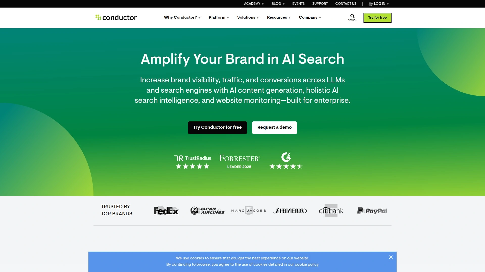

Conductor combines search behavior understanding, content performance monitoring, and website health tracking for comprehensive optimization. Multi-keyword analysis compares up to five terms uncovering related topics and expansion opportunities. Competition analysis monitors competitor traffic, rankings, and content performance.

Content guidance provides performance insights and topic ideas from platform data. Real-time technical monitoring through ContentKing continuously scans for issues alerting teams instantly. Daily rank tracking shows keyword position movements distinguishing temporary fluctuations from significant trends.

**Collaboration emphasis** supports large teams working across substantial websites. Customized pricing based on organizational needs means contacting sales for quotes. The platform particularly suits marketing teams needing centralized insights refining digital strategies.

Best for businesses strengthening organic presence through systematic content refinement. Conductor benefits teams prioritizing collaborative workflows and comprehensive monitoring. The platform excels for organizations wanting unified intelligence platform over point solutions.

## **[Semrush Writing Assistant](https://www.semrush.com)**

Real-time SEO and readability feedback integrated with Semrush ecosystem.

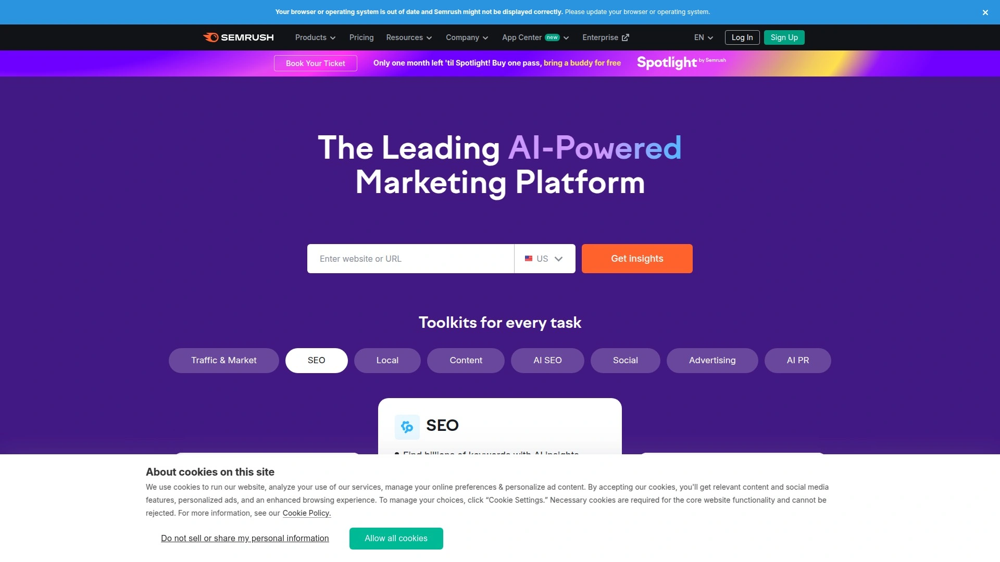

Semrush Writing Assistant provides real-time scoring for SEO, readability, tone consistency, and originality within writing platforms. Keyword suggestions draw from Semrush's massive database ensuring recommendations based on actual search data. Plagiarism checker verifies content originality preventing duplicate content issues.

Google Docs integration enables optimization during drafting without platform switching. Tone consistency analysis ensures brand voice remains uniform across content. Recommendations adapt based on target location and device preferences.

**Semrush integration** makes this natural extension for existing Semrush users already paying for broader platform. Requires Guru plan at $249.95 monthly making it expensive for standalone writing tool. The platform particularly suits organizations already invested in Semrush ecosystem.

Easy for Semrush users though moderate learning curve for beginners. Semrush Writing Assistant benefits content marketers wanting writing optimization within familiar toolset. The platform excels when content optimization represents one component of comprehensive Semrush usage.

## **[Outranking](https://www.outranking.io)**

Granular writing guidance with step-by-step optimization instructions.

Outranking delivers most detailed writing guidance through step-by-step outlines directing exactly what to write. Internal linking recommendations identify optimal anchor text and target pages. Featured snippet optimization targets specific SERP features with formatted content.

Automated content audits scan existing pages identifying optimization opportunities systematically. Competitor analysis reveals content gaps and improvement opportunities. Real-time scoring updates as you write showing immediate optimization impact.

**Granular approach** suits writers wanting precise direction though denser UI requires adjustment. Promotional first-month pricing at $7 makes trial extremely accessible. The platform particularly benefits SEO writers wanting comprehensive step-by-step guidance.

Detailed recommendations prevent uncertainty about next optimization steps. Outranking suits perfectionists refusing to publish until content achieves maximum optimization. The platform excels for teams prioritizing thoroughness over speed.

## **[GrowthBar](https://www.growthbar.ai)**

Budget-friendly all-in-one with AI blog writer and Chrome extension.

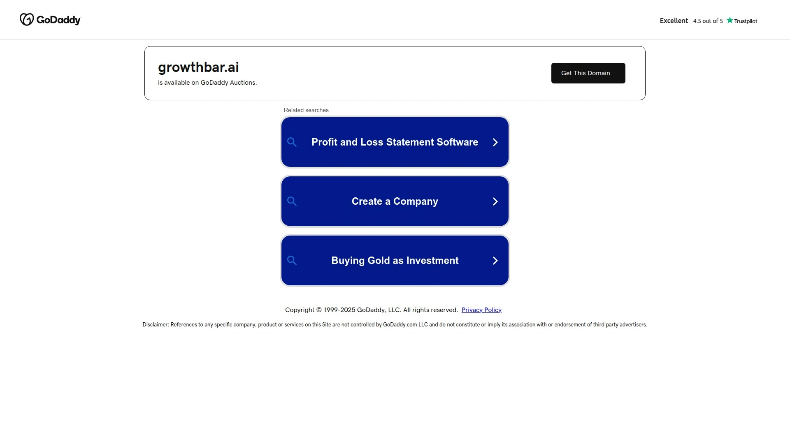

GrowthBar provides broad feature set at entry-level pricing making professional SEO accessible. AI blog writer generates complete articles from prompts while optimizer ensures content ranks. Chrome extension enables keyword research and competitive analysis directly from search results.

WordPress plugin streamlines publishing optimized content directly to sites. Backlink analysis reveals link-building opportunities. Keyword research with difficulty scores helps topic selection.

**Value positioning** delivers extensive features at $48 monthly undercutting specialized alternatives. Very easy interface welcomes beginners intimidated by complex enterprise tools. The platform particularly suits bloggers and small businesses wanting comprehensive toolkit affordably.

Best for users prioritizing affordability and ease over advanced optimization precision. GrowthBar benefits creators wanting good-enough optimization without premium pricing. The platform excels for budget-conscious users needing complete SEO workflow.

## FAQ

**What's the difference between content optimization tools and keyword research tools?**
Keyword research tools identify search terms people use while content optimization platforms analyze top-ranking pages revealing exactly what content structure, depth, and topics you need to rank. Optimization tools provide real-time scoring as you write showing whether your content matches ranking requirements, whereas keyword tools simply list search volumes and difficulty. Most modern platforms combine both capabilities though emphasis varies between strategic planning versus tactical optimization.

**Do content optimization tools guarantee higher search rankings?**
No tool guarantees rankings since Google's algorithm considers hundreds of factors beyond on-page optimization like backlinks, domain authority, and user engagement signals. However, optimization tools dramatically improve your odds by ensuring content comprehensively covers topics, uses relevant semantic terms, and matches search intent that ranking pages satisfy. Think of them as removing obvious obstacles rather than guaranteeing success—you still need quality writing, promotion, and time.

**Which content optimization tool works best for small businesses on tight budgets?**
Frase delivers the most value for small budgets at $45 monthly with comprehensive features including research, writing, and optimization in one platform. GrowthBar provides broad capabilities at $48 monthly with very easy interface welcoming beginners. For the tightest budgets, start with free tiers from MarketMuse or trial periods from multiple tools testing which workflow fits before committing.

## Optimize Content Strategy With Data-Driven Confidence

AI content optimization platforms transform uncertain content creation into systematic planning where you know exactly what to write, how deep to go, and which topics offer easiest wins before investing time and budget. [MarketMuse](https://www.marketmuse.com) excels for enterprise teams and serious content operations requiring comprehensive topic modeling, personalized difficulty scoring based on your existing authority, and strategic planning capabilities that identify quick wins while building long-term topical dominance across entire content libraries. Choose platforms matching your priorities whether affordability, ease of use, precision, or strategic depth, then let AI guide decisions currently made through guesswork and intuition.
